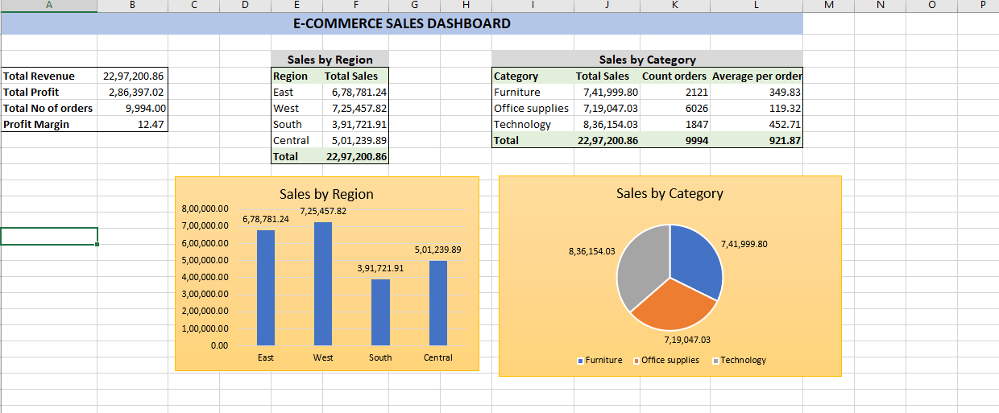

# E-Commerce Sales Dashboard

## Overview

A comprehensive **Excel-based analytics dashboard** analyzing e-commerce sales performance across regions and product categories. This project demonstrates core business analytics skills including data analysis, visualization, and actionable insights.

---

## Dashboard Preview

## Problem Statement

An e-commerce superstore needed to understand:
- Which regions are driving the most revenue?
- Which product categories are most profitable?
- What's the profitability margin for each category?
- How does customer spending vary by region and product type?

---

## Dataset

**Source:** Sample Superstore Dataset  
**Rows:** 9,995 orders  
**Columns:** 19 attributes (Order ID, Customer, Product, Sales, Profit, Region, Category, etc.)  

---

## Analysis Performed

### Key Metrics
- **Total Revenue:** $2,297,200.86
- **Total Profit:** $286,397.02
- **Total Orders:** 9,994
- **Overall Profit Margin:** 12.47%

### Sales by Region
| Region | Total Sales | % of Total |
|--------|------------|-----------|
| West | $725,457.82 | 31.6% |
| East | $678,781.24 | 29.5% |
| Central | $501,239.89 | 21.8% |
| South | $391,721.91 | 17.0% |

### Sales by Category
| Category | Total Sales | Orders | Avg/Order |
|----------|------------|--------|-----------|
| Technology | $836,154.03 | 1,847 | $452.71 |
| Office Supplies | $719,047.03 | 6,026 | $119.32 |
| Furniture | $741,999.80 | 2,121 | $349.83 |

---

## Key Business Insights

1. **Technology drives highest profit per order** ($452.71) — Focus marketing efforts here
2. **Office Supplies has volume but low margins** ($119.32 per order) — Investigate pricing strategy
3. **Furniture is underperforming** ($18.4k total profit despite $742k sales) — Review cost structure
4. **West region leads** but South needs attention — Develop regional growth strategy

---

## Skills Demonstrated

### Excel Functions
- **SUMIF()** — Sum with conditions
- **COUNTIF()** — Count with conditions  
- **AVERAGEIF()** — Average with conditions
- **Charts & Dashboards** — Professional visualization

### Analytics Concepts
- Data aggregation and summarization
- Performance metrics and margins
- Comparative analysis across dimensions
- Business insight generation

---

## Files Included

- `E-Commerce-Sales-Dashboard_Sri.xlsx` — Complete Excel workbook
- `README.md` — This documentation

---

## How to Use

1. Open `E-Commerce-Sales-Dashboard_Sri.xlsx`
2. Navigate to "Dashboard" sheet
3. Review charts and metrics
4. Refer to this README for interpretation

All metrics are **dynamically calculated** using formulas.

---

## Future Enhancements

- Power BI interactive dashboard
- Time-series trend analysis
- Customer RFM segmentation
- SQL database integration
- Sales forecasting models

---

**Created:** June 2026  
**Status:** Complete  
**Portfolio Project Type:** Business Analytics
